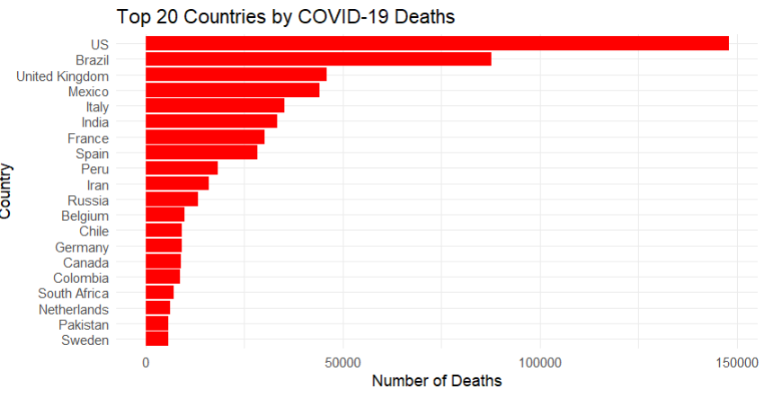

# DS-COVID-19-Country-Wise-Data-Analysis

This project explores and analyzes global country-wise COVID-19 data using R.
It covers the full workflow: cleaning, transforming, visualizing, and interpreting the dataset to uncover meaningful insights about how the pandemic affected different regions worldwide.

The dataset was sourced from Kaggle and includes key attributes such as confirmed cases, deaths, recoveries, active cases, weekly changes, WHO region, and mortality/recovery ratios.

---

# 📌 Project Goals

- Clean and prepare real-world COVID-19 data
- Handle missing values (mean, median, mode)
- Detect and correct outliers
- Convert numerical attributes → categorical, and back
- Normalize numeric variables
- Balance the dataset
- Visualize trends using ggplot2
- Compute descriptive and comparative statistics
- Explore mortality patterns across countries


---

# 📊 Dataset Information

Dataset Name: COVID-19 Dataset
Rows: 187
Columns: 15
Source: Kaggle
🔗 https://www.kaggle.com/datasets/imdevskp/corona-virus-report

The dataset includes variables such as:
- Country / Region
- Confirmed
- Deaths
- Recovered
- Active
- New Cases / New Deaths
- Deaths per 100 Cases
- Confirmed last week, Weekly change
- WHO Region

---

# 🧹 Data Cleaning Steps

- Replaced empty strings
- Identified and fixed missing values
- Removed incomplete rows
- Checked for duplicates
- Converted invalid region values
- Repaired negative values
- Treated outliers using the IQR method


---

# ⚙️ Feature Engineering

- Converted mortality ratio to Low / Medium / High categories
- Mapped categories back to numeric codes
- Applied min–max normalization to main numeric variables
- Balanced the dataset using undersampling

---

# 📈 Visualizations

- Missing value map
- Boxplot for outlier detection
- Top 20 countries by total deaths
- Comparative statistics plots
- Bar charts and summary graphics
- These visuals help highlight which countries were hit hardest and how death rates differ across groups.

---

# 📐 Statistical Analysis

- Means and standard deviation by category
- Variability metrics (range, IQR, variance, SD)
- Group-wise comparison of confirmed, recovered, active, and death cases
- The analysis helps show patterns like:
- Countries with high mortality rates usually had much larger outbreaks
- Strong positive correlation between confirmed cases and deaths
- Regional variation in severity

---

## How to Run the Project
Install libraries
```
install.packages("dplyr")
install.packages("ggplot2")
install.packages("naniar")
```
## Load dataset
```
mydata <- read.csv("data/country_wise_latest_update.csv", header = TRUE)
```

## Run the analysis
```
source("scripts/covid_analysis.R")
```

---

# 📊 Result Overview



---
# 🧑‍💻 Author

Md. Emran Nazir Efty

📧 globalfabricapparel@gmail.com

🌐 https://linktr.ee/globalfabricapparel

📍 Dhaka, Bangladesh
